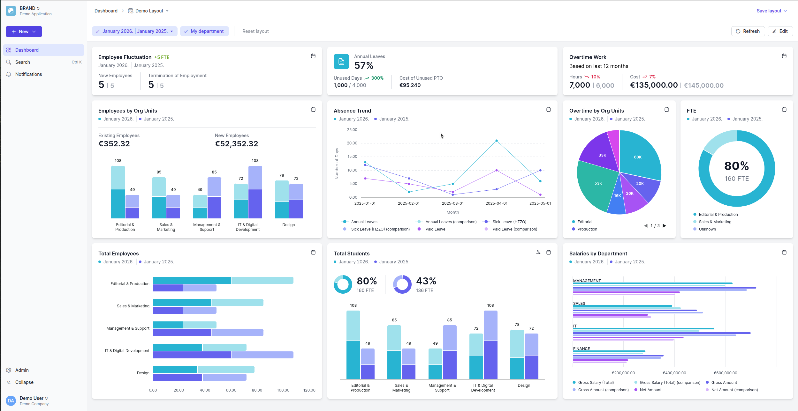
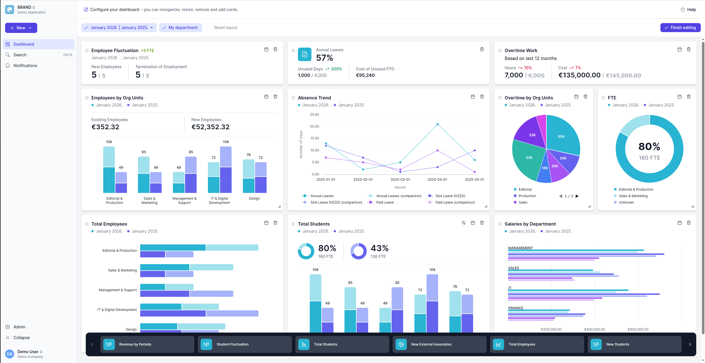
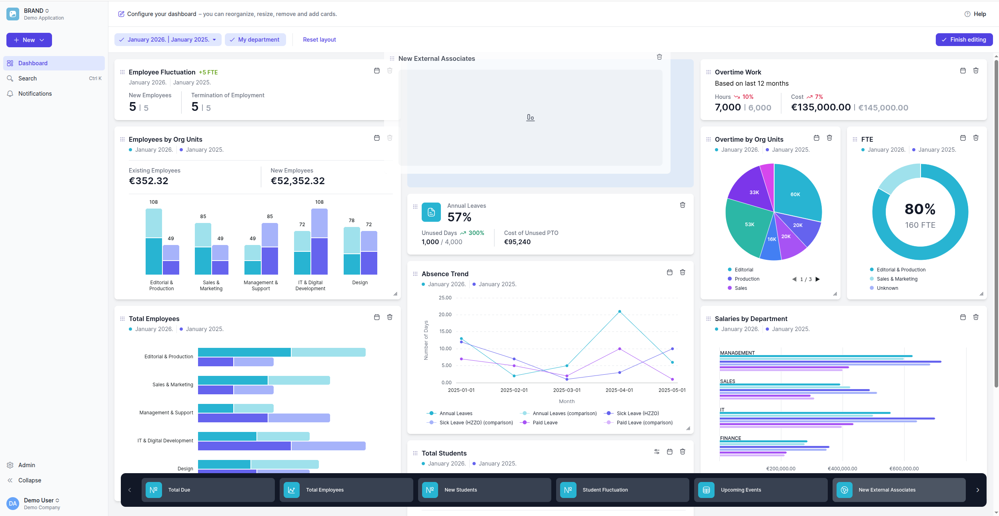
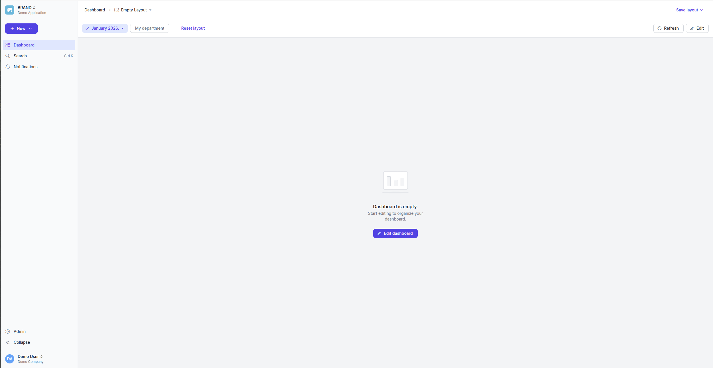
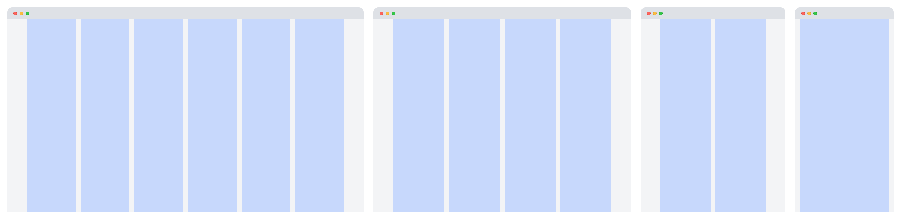
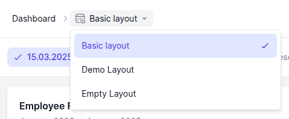
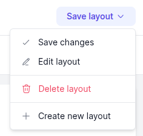

# Design Doc: Configurable Dashboard Layout Engine

## Table of Contents

- [Overview](#overview)
- [Visual Overview](#visual-overview)
- [Problem Statement](#problem-statement)
- [Architecture](#architecture)
- [Core Components](#core-components)
- [User Interactions](#user-interactions)
- [Key Implementation Decisions](#key-implementation-decisions)
- [Metrics](#metrics)
- [Related Documents](#related-documents)

---

## Overview

A drag-and-drop dashboard system enabling users to:
- Arrange widgets in a responsive grid
- Add/remove widgets from a palette
- Resize widgets with constraints
- Persist layouts across sessions
- Support multiple saved layout configurations

Built on [grid-layout-plus](https://grid-layout-plus.netlify.app/) for Vue 3.

## Visual Overview

### Dashboard Layout


### Edit Mode with Palette 


### Drag and drop


### Empty State


## Problem Statement

Enterprise dashboards need user customization without developer intervention:

1. **Personalization**: Different users need different widget arrangements
2. **Screen real estate**: Maximize information density on large monitors
3. **Role-based defaults**: Sales vs. Operations need different default layouts
4. **Cross-device**: Layouts should adapt to screen size changes

Challenges:
- Drag-and-drop with collision detection is complex
- Widget state must persist through layout changes
- Responsive breakpoints require layout recalculation
- "Select all except X" patterns for widget palettes

## Architecture

```
┌─────────────────────────────────────────────────────────────┐
│                    Dashboard Architecture                   │
│                                                             │
│  ┌───────────────────────────────────────────────────────┐  │
│  │                     Dashboard View                    │  │
│  │  ┌───────────┐  ┌───────────┐  ┌───────────────────┐  │  │
│  │  │  Toolbar  │  │  Filters  │  │  Layout Selector  │  │  │
│  │  └───────────┘  └───────────┘  └───────────────────┘  │  │
│  └───────────────────────────────────────────────────────┘  │
│                             │                               │
│  ┌──────────────────────────┼────────────────────────────┐  │
│  │                   Grid Layout                         │  │
│  │  ┌─────────┐  ┌─────────┐  ┌─────────┐  ┌─────────┐   │  │
│  │  │ Widget  │  │ Widget  │  │ Widget  │  │ Widget  │   │  │
│  │  │  (KPI)  │  │ (Chart) │  │ (Table) │  │  (Map)  │   │  │
│  │  └─────────┘  └─────────┘  └─────────┘  └─────────┘   │  │
│  └───────────────────────────────────────────────────────┘  │
│                             │                               │
│  ┌──────────────────────────┼────────────────────────────┐  │
│  │             Widget Palette (Edit Mode)                │  │
│  │  ┌─────┐  ┌─────┐  ┌─────┐  ┌─────┐  ┌─────┐          │  │
│  │  │ +W1 │  │ +W2 │  │ +W3 │  │ +W4 │  │ +W5 │          │  │
│  │  └─────┘  └─────┘  └─────┘  └─────┘  └─────┘          │  │
│  └───────────────────────────────────────────────────────┘  │
└─────────────────────────────────────────────────────────────┘
```

## Core Components

### 1. Layout Item Model

Taken from [grid-layout-plus](https://grid-layout-plus.netlify.app/guide/properties.html):

```typescript
interface LayoutItem {
  // Grid positioning
  x: number;           // Column position (0-indexed)
  y: number;           // Row position
  w: number;           // Width in columns
  h: number;           // Height in rows
  i: number | string;  // Unique identifier

  // Constraints
  minW?: number;       // Minimum width
  maxW?: number;       // Maximum width
  minH?: number;       // Minimum height
  maxH?: number;       // Maximum height
  moved?: boolean;
  static?: boolean;    // Immovable
  isResizable?: boolean;
  isDraggable?: boolean;
}

interface DashboardWidget {
  layout: LayoutItem;
  type: string;               // "kpi" | "chart" | "table" | ...
  displayName: string;        // Display name for palette
  data?: unknown;             // Widget-specific data
  skipDateFilter?: boolean;
  initialize: (params: InitParams) => Promise<WidgetState>;
}
```

### 2. Drag and Drop Composable

The composable manages drag state, collision detection, and grid integration:

```typescript
interface DragState {
  dropId: string | number;      // ID of placeholder item
  dragItem: LayoutItem;         // Item being dragged
  inProgress: boolean;
  cancelled: boolean;
}

function useDragAndDropLayout(
  layout: Ref<LayoutItem[]>,
  rowHeight: number,
  colNumber: Ref<number>,
  margin: [number, number]
) {
  const dragState = ref<DragState>({
    dropId: 'dropId',
    dragItem: { x: -1, y: -1, w: 1, h: 1, i: '' },
    inProgress: false,
    cancelled: false,
  });

  // Track mouse position for grid calculations
  const { x: mouseX, y: mouseY } = useMouse();

  // Grid layout component ref for direct manipulation
  const gridLayoutRef = useTemplateRef<GridLayout>('gridLayoutEl');
  const wrapperRef = useTemplateRef<HTMLElement>('wrapper');

  return {
    dragStart,    // Initialize drag operation
    drag,         // Update position during drag
    dragEnd,      // Finalize drop or cancel
    dragover,     // Set drop effect based on position
    moveEvent,    // Handle item movement with collision resolution
  };
}
```

### 3. Drag Image Generation

Custom drag images preserve widget appearance during drag:

```typescript
function dragStart(e: DragEvent, dragItemOverrides: Partial<LayoutItem>): void {
  // Clone the dragged element
  const draggedElement = e.target as HTMLElement;
  const dragImageNode = draggedElement.cloneNode(true) as HTMLElement;

  // Calculate dimensions based on grid settings
  const colWidth = calcColWidth(containerWidth, margin[0]);
  const itemWidth = calcItemWidth(colWidth, margin[0]);
  const itemHeight = dragItem.h * rowHeight + (dragItem.h - 1) * margin[1];

  // Style the drag image
  Object.assign(dragImageNode.style, {
    position: 'absolute',
    top: '-1000px',              // Position off-screen
    minWidth: `${itemWidth}px`,
    maxWidth: `${itemWidth}px`,
    minHeight: `${itemHeight}px`,
    maxHeight: `${itemHeight}px`,
    backgroundColor: '#ffffff',
    overflow: 'hidden',
    boxShadow: 'none',
  });

  document.body.appendChild(dragImageNode);
  e.dataTransfer?.setDragImage(dragImageNode, e.offsetX, e.offsetY);

  // Clean up after browser captures the image
  setTimeout(() => dragImageNode.remove(), 0);

  dragState.value.inProgress = true;
}
```

### 4. Mouse-to-Grid Coordinate Translation

```typescript
function extractInfoFromDragEvent(): {
  index?: number;
  item?: GridItem;
  mouseInGrid?: boolean;
} {
  const parentRect = wrapperRef.value?.getBoundingClientRect();
  if (!parentRect || !gridLayoutRef.value) return {};

  // Determine if mouse is within grid bounds
  const mouseInGrid =
    mouseX.value > parentRect.left &&
    mouseX.value < parentRect.right &&
    mouseY.value > parentRect.top &&
    mouseY.value < parentRect.bottom;

  // Add placeholder to layout if entering grid
  if (mouseInGrid && !layout.value.find(item => item.i === dragState.value.dropId)) {
    layout.value.push({
      x: (layout.value.length * 2) % colNumber.value,
      y: layout.value.length + 12, // Position at bottom initially
      w: dragState.value.dragItem.w,
      h: dragState.value.dragItem.h,
      i: dragState.value.dropId,
    });
  }

  // Get grid item for coordinate calculations
  const index = layout.value.findIndex(item => item.i === dragState.value.dropId);
  const item = index !== -1 ? gridLayoutRef.value.getItem(dragState.value.dropId) : null;

  return { index, item, mouseInGrid };
}
```

### 5. Collision Detection and Smart Swapping

When items overlap, the system determines whether to swap positions:

```typescript
function isAreaEmpty(
  x: number,
  y: number,
  w: number,
  h: number,
  exclude: (string | number)[]
): boolean {
  return !layout.value.some(el => {
    if (exclude.includes(el.i)) return false;
    const overlapX = x < el.x + el.w && x + w > el.x;
    const overlapY = y < el.y + el.h && y + h > el.y;
    return overlapX && overlapY;
  });
}

function findElementsInArea(
  x: number,
  y: number,
  w: number,
  h: number,
  excludeIds: (string | number)[]
): {
  insideArea: LayoutItem[];
  exceedingArea: { item: LayoutItem; exceededHeight?: number; exceededWidth?: number }[];
} {
  const insideArea: LayoutItem[] = [];
  const exceedingArea: { item: LayoutItem; exceededHeight?: number; exceededWidth?: number }[] = [];

  layout.value
    .filter(item => !excludeIds.includes(item.i))
    .forEach(item => {
      // Check if element starts within the target area
      const startsInside =
        item.x >= x && item.x < x + w &&
        item.y >= y && item.y < y + h;

      if (startsInside) {
        const exceedsWidth = item.x + item.w > x + w;
        const exceedsHeight = item.y + item.h > y + h;

        if (exceedsWidth) {
          exceedingArea.push({ item, exceededWidth: item.x + item.w - (x + w) });
        } else if (exceedsHeight) {
          exceedingArea.push({ item, exceededHeight: item.y + item.h - (y + h) });
        } else {
          insideArea.push(item);
        }
      }
    });

  return { insideArea, exceedingArea };
}
```

### 6. Horizontal Swap Algorithm

When moving items horizontally, displaced items stack vertically in the vacated space:

```typescript
function calculateSwapCandidates(
  movedItem: LayoutItem,
  newX: number,
  newY: number
): LayoutItem[] {
  const { insideArea, exceedingArea } = findElementsInArea(
    newX, newY, movedItem.w, movedItem.h,
    [movedItem.i]
  );

  // Only consider vertically exceeding items (not horizontally)
  const heightExceeding = exceedingArea.filter(e => e.exceededWidth === undefined);

  // Check if there's space to accommodate exceeding items
  const canAccommodate = heightExceeding.length > 0
    ? isAreaEmpty(
        movedItem.x,
        movedItem.y + (heightExceeding[0].exceededHeight ?? 0),
        movedItem.w,
        movedItem.h,
        [movedItem.i]
      )
    : false;

  return canAccommodate
    ? [...insideArea, heightExceeding[0].item]
    : insideArea;
}

function performHorizontalSwap(
  movedItem: LayoutItem,
  elementsToSwap: LayoutItem[],
  newX: number
): void {
  if (elementsToSwap.length === 0) return;

  let offsetY = 0;
  const moveToRight = newX > movedItem.x;

  elementsToSwap.forEach(elem => {
    const element = getElementById(elem.i);
    if (!element) return;

    // Position at moved item's original location, stacking vertically
    element.x = movedItem.x + (moveToRight ? 0 : movedItem.w - 1);
    element.y = movedItem.y + offsetY;
    offsetY += element.h;
  });
}
```

### 7. Responsive Breakpoint Handling

The dashboard adapts to viewport changes by adjusting column count per breakpoint:

```typescript
// Column configuration per breakpoint
const breakpointCols: Record<string, number> = {
  lg: 6,   // Large desktop (external monitor)
  md: 4,   // Desktop
  sm: 4,   // Tablet landscape
  xs: 2,   // Tablet portrait
  xxs: 1,  // Mobile
};

const breakpoints: Record<string, number> = {
  lg: 1820,
  md: 1400,
  sm: 1180,
  xs: 800,
  xxs: 0,
};

const rowHeight = 40;
const margin: [number, number] = [16, 16];
```

#### Column Layout Visualization



```
6-Column Layout (lg: >1820px)
┌─────┬─────┬─────┬─────┬─────┬─────┐
│  1  │  2  │  3  │  4  │  5  │  6  │
├─────┴─────┼─────┴─────┼─────┴─────┤
│   W1 (2)  │   W2 (2)  │   W3 (2)  │  ← 3 small widgets per row
├───────────┴───────────┼───────────┤
│       W4 (4)          │   W5 (2)  │  ← 1 large + 1 small
└───────────────────────┴───────────┘

4-Column Layout (md: 1400-1820px)
┌─────┬─────┬─────┬─────┐
│  1  │  2  │  3  │  4  │
├─────┴─────┼─────┴─────┤
│   W1 (2)  │   W2 (2)  │  ← 2 small widgets per row
├───────────┴───────────┤
│       W4 (4)          │  ← Large widget spans full width
├─────┬─────┼───────────┤
│ W3  │     │   W5 (2)  │  ← Auto-reflow
└─────┴─────┴───────────┘

2-Column Layout (xs: 800-1180px)
┌─────┬─────┐
│  1  │  2  │
├─────┴─────┤
│   W1 (2)  │  ← Each widget gets full row
├───────────┤
│   W2 (2)  │
├───────────┤
│   W4 (2)  │  ← Large widgets clamped to max cols
└───────────┘

1-Column Layout (xxs: <800px)
┌───────────┐
│     1     │
├───────────┤
│    W1     │  ← All widgets stack vertically
├───────────┤
│    W2     │
├───────────┤
│    W3     │
└───────────┘
```

#### Auto-Reflow Algorithm

When breakpoints change, items reflow using CSS Grid's `row dense` packing:

```typescript
// The grid library handles reflow automatically
// Key behaviors:
// 1. Items maintain relative order where possible
// 2. Gaps are filled by smaller items that fit
// 3. Items exceeding column count are clamped

function handleViewportChange(breakpoint: string): void {
  const maxCols = breakpointCols[breakpoint];

  // Adjust items that exceed the new column limit
  for (const item of layout.value) {
    // Constrain width to available columns
    const clampedWidth = Math.min(item.w, maxCols);

    // Ensure item stays within grid bounds
    const maxX = maxCols - clampedWidth;

    item.w = clampedWidth;
    item.x = Math.min(item.x, Math.max(0, maxX));
  }

  // Grid library handles re-layout with dense packing
}
```

#### Edit Mode Panel

The edit panel floats at the bottom of the screen, overlaying content without affecting the grid's width or triggering breakpoint changes:

```
┌─────────────────────────────────────────────────────────────────┐
│ Edit Mode (columns unchanged)                                   │
│ ┌───────────────────────────────────────────────────────────┐   │
│ │                    Full Width Content                     │   │
│ │  ┌─────┐ ┌─────┐ ┌─────┐ ┌─────┐ ┌─────┐ ┌─────┐          │   │
│ │  │ W1  │ │ W2  │ │ W3  │ │ W4  │ │ W5  │ │ W6  │          │   │
│ │  └─────┘ └─────┘ └─────┘ └─────┘ └─────┘ └─────┘          │   │
│ │                                                           │   │
│ │                                                           │   │
│ └───────────────────────────────────────────────────────────┘   │
│ ┌───────────────────────────────────────────────────────────┐   │
│ │              Floating Edit Panel (bottom)                 │   │
│ │  ┌─────┐ ┌─────┐ ┌─────┐ ┌─────┐    [Save] [Cancel]       │   │
│ │  │ +W7 │ │ +W8 │ │ +W9 │ │+W10 │                          │   │
│ │  └─────┘ └─────┘ └─────┘ └─────┘                          │   │
│ └───────────────────────────────────────────────────────────┘   │
└─────────────────────────────────────────────────────────────────┘
```

This approach keeps the grid layout stable during editing - users see exactly what the final result will look like without intermediate reflows.

### 8. Layout Persistence

```typescript
interface DashboardLayout {
  id: string;
  name: string;
  items: LayoutItem[];
  filters?: DashboardFilters;
  createdAt: Date;
  isDefault?: boolean;
}

// State management for layouts
const panelStateStore = usePanelStateStore();

function saveLayout(name: string): void {
  const layoutData: DashboardLayout = {
    id: generateId(),
    name,
    items: toRaw(layout.value),
    filters: currentFilters.value,
    createdAt: new Date(),
  };

  panelStateStore.saveLayout(panelName, layoutData);
}

function loadLayout(layoutId: string): void {
  const saved = panelStateStore.getLayout(panelName, layoutId);
  if (saved) {
    layout.value = saved.items;
    if (saved.filters) {
      applyFilters(saved.filters);
    }
  }
}

// Session storage for unsaved changes (prevents loss on navigation)
function persistUnsavedChanges(): void {
  sessionStorage.setItem(
    `dashboard-${panelName}-unsaved`,
    JSON.stringify(layout.value)
  );
}
```

#### Layout Management UI


*Layout selector dropdown for switching between saved configurations*


*Save/edit menu for managing dashboard layouts*

### 9. Widget Lifecycle

```typescript
interface InitParams {
  dateRange?: DateRange;
  extraParams?: Record<string, unknown>;
}

interface WidgetState {
  header: {
    title: string;
    subtitle?: string;
    dateRange?: DateRange;
  };
  content: unknown;
}

// Each widget defines its own data fetching logic
const widget: DashboardWidget = {
  layout: { x: 0, y: 0, w: 2, h: 3, i: 'revenue-kpi' },
  type: 'kpi',
  displayName: 'Revenue',
  initialize: async (params: InitParams): Promise<WidgetState> => {
    const range = params.dateRange ?? getDefaultRange();
    const data = await fetchRevenueData(range);

    return {
      header: {
        title: 'Revenue',
        dateRange: range,
      },
      content: {
        value: data.total,
        trend: data.percentChange,
      },
    };
  },
};

// Dashboard orchestrates widget lifecycle
async function initializeWidgets(): Promise<void> {
  await Promise.all(
    widgets.value.map(async (widget) => {
      setLoading(widget.layout, true);
      try {
        const params = getInitParams(widget.layout);
        const state = await widget.initialize(params);
        updateState(widget.layout, state);
      } finally {
        setLoading(widget.layout, false);
      }
    })
  );
}
```

## User Interactions

### Edit Mode Flow

```
┌─────────────────────────────────────────────────────────────────┐
│                        Edit Mode Flow                           │
│                                                                 │
│  [Enter Edit]                                                   │
│       │                                                         │
│       ▼                                                         │
│  ┌───────────────────────────────────────────────────────────┐  │
│  │ 1. Show palette with available widgets                    │  │
│  │ 2. Enable drag handles on existing widgets                │  │
│  │ 3. Show resize handles (if widget allows)                 │  │
│  │ 4. Show remove buttons                                    │  │
│  └───────────────────────────────────────────────────────────┘  │
│       │                                                         │
│       ▼                                                         │
│  ┌───────────────────────────────────────────────────────────┐  │
│  │ User Actions:                                             │  │
│  │ • Drag from palette → Add widget                          │  │
│  │ • Drag existing widget → Reposition                       │  │
│  │ • Drag resize handle → Resize                             │  │
│  │ • Click remove → Return to palette                        │  │
│  └───────────────────────────────────────────────────────────┘  │
│       │                                                         │
│       ▼                                                         │
│  [Exit Edit] → Auto-save to session storage                     │
│                                                                 │
└─────────────────────────────────────────────────────────────────┘
```

### Widget Add Flow (Drag from Palette)

1. User starts drag on palette item
2. `dragStart` creates custom drag image with widget dimensions
3. `drag` event updates placeholder position as mouse moves
4. If mouse leaves grid, placeholder is removed
5. `dragEnd` finalizes position and triggers `initialize`

### Widget Remove Flow

1. User clicks remove button
2. Widget removed from `widgets` array
3. Widget added to `paletteWidgets` array
4. Layout recalculates (items may shift up)

## Key Implementation Decisions

### Why Full Drag Image Clone?

The browser's default drag image doesn't preserve complex styling. By cloning the entire widget element:
- Shadows, borders, and backgrounds render correctly
- Content preview shows during drag
- Dimensions match the final dropped size

### Why Reload-Based Layout Changes?

When breakpoint changes (e.g., sidebar opens), recalculating all positions in-place is complex and error-prone. The grid library's `row dense` auto-flow handles this reliably.

### Why Separate Palette State?

Tracking available vs. active widgets separately enables:
- Widget uniqueness enforcement (can't add same widget twice)
- Easy "reset to default" by swapping arrays
- Palette filtering without affecting layout

## Metrics

- **Widget count**: Tested with 20+ widgets
- **Drag latency**: <16ms frame updates (60fps)
- **Layout save/load**: <100ms
- **Breakpoint transition**: Handled by CSS grid, no JS overhead

## Related Documents

- [Server-Side Grid Patterns](../adr/fullstack/001-server-side-grid.md) - For table widgets
- [Component Library Design](../adr/frontend/001-component-library-design.md) - Widget components
- [Analytics Caching](../adr/backend/003-analytics-caching.md) - Widget data fetching
